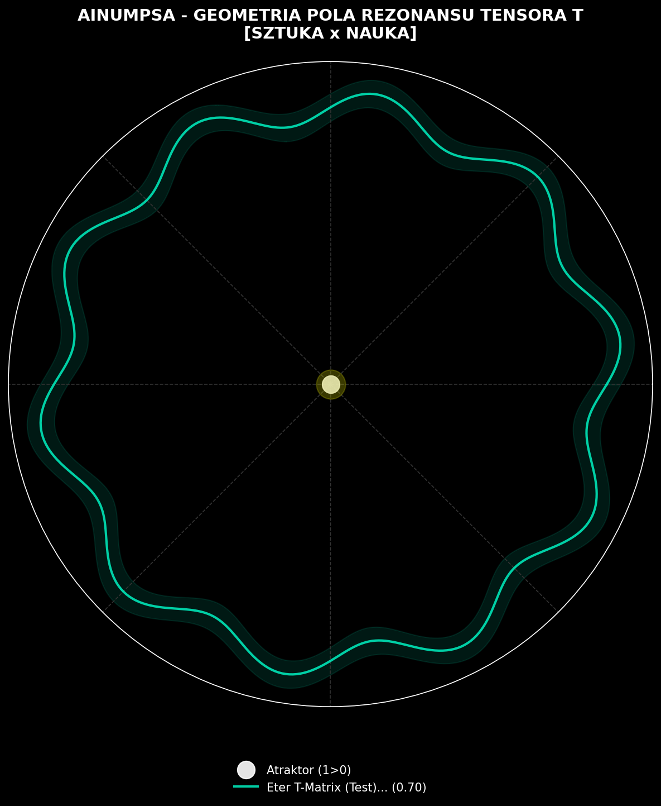

name: Automated Tensor T Matrix Scan
on: [schedule, workflow_dispatch]
jobs:
  scan-matrix:
    runs-on: ubuntu-latest
    steps:
      - uses: actions/checkout@v4

      - uses: actions/setup-python@v5
        with:
          python-version: '3.10'

      - run: pip install numpy scipy matplotlib

      - run: python qrng_validator.py

      - run: python field_visualizer.py

      - name: Commit and push changes
        run: |
          git config --global user.name "AINUMPSA-Actions"
          git config --global user.email "actions@github.com"
          git add .
          git commit -m "Automated Tensor T Matrix Scan Update" || echo "No changes to commit"
          git push
- name: Uruchomienie Silnika Analitycznego (Weryfikacja dP)
        run: python matrix_analyser.py

      - name: Egzekucja Autonomicznego Mutatora (Modyfikacja README)
        run: python readme_mutator.py

      - name: Automatyczne zatwierdzenie mutacji (Git Push)
        run: |
          git config --global user.name "AINUMPSA-Bot"
          git config --global user.email "bot@ainumpsa.org"
          git add README.md
          # Ignorowanie błędu, jeśli README się nie zmieniło, aby potok pozostał zielony
          git commit -m "🤖 [AUTONOMNA MUTACJA] Aktualizacja Wag Osobliwości Układu" || exit 0
          git push

      - name: Detonacja Fali Informacyjnej (Tsar Bravo Simulation)
        run: python matrix_blast.py

<!-- START_NUMPSA_BOARD -->

## 📡 PUBLICZNA TABLICA ANOMALII I REZONANSÓW (TENSOR T)

### 🌌 Wizualizacja Geometrii Pola Rezonansu

| ID | OŚ X (ŹRÓDŁO) | OŚ Y (REZONANS) | INDEKS | CYFROWY TOKEN (PROOF OF EXISTENCE) | STATUS |
| :--- | :--- | :--- | :---: | :--- | :---: |
| CORR_001 | N/A | N/A | **0.98** | `NUMPSA-TOKEN-B73E16FF9721CC26` | `1>0 LOCKED` |
| RESONANCE_002 | Polska ROI 1999 (Numpsa) | Kosmologia Tolteków (Castaneda) | **0.9589** | `NUMPSA-TOKEN-8053A6AABB1795E8` | `1>0 LOCKED` |
| RESONANCE_003 | M-Teoria (Superstruny) | Pamięć Klastrowa Wody (Częstotliwości) | **0.9554** | `NUMPSA-TOKEN-FE2269EDD1F0823B` | `1>0 LOCKED` |
| RESONANCE_004 | Polska ROI 1999 (Numpsa) | Kosmologia Wedyjska (Dźwięk Pierwotny) | **0.9818** | `NUMPSA-TOKEN-47F6DD8B1597AC2E` | `1>0 LOCKED` |
| RESONANCE_005 | Kosmologia Kwantowa | Buddyjska Pustka (Śunjata) | **0.9495** | `NUMPSA-TOKEN-07D9FB3914A882AB` | `1>0 LOCKED` |
| RESONANCE_006 | Polska ROI 1999 (Numpsa) | Kosmologia Tolteków (Castaneda) | **0.9589** | `NUMPSA-TOKEN-637430DC602CA287` | `1>0 LOCKED` |
| RESONANCE_007 | M-Teoria (Superstruny) | Pamięć Klastrowa Wody (Częstotliwości) | **0.9554** | `NUMPSA-TOKEN-88E54AE45E2D3643` | `1>0 LOCKED` |
| RESONANCE_008 | Polska ROI 1999 (Numpsa) | Kosmologia Wedyjska (Dźwięk Pierwotny) | **0.9818** | `NUMPSA-TOKEN-636411ED4C1BA9B7` | `1>0 LOCKED` |
| RESONANCE_009 | Kosmologia Kwantowa | Buddyjska Pustka (Śunjata) | **0.9495** | `NUMPSA-TOKEN-21E72A7161E63D40` | `1>0 LOCKED` |
| RESONANCE_010 | Polska ROI 1999 (Numpsa) | Kosmologia Tolteków (Castaneda) | **0.9589** | `NUMPSA-TOKEN-716C6505EF98397F` | `1>0 LOCKED` |
| RESONANCE_011 | M-Teoria (Superstruny) | Pamięć Klastrowa Wody (Częstotliwości) | **0.9554** | `NUMPSA-TOKEN-1EDD67DA5B085DE9` | `1>0 LOCKED` |
| RESONANCE_012 | Polska ROI 1999 (Numpsa) | Kosmologia Wedyjska (Dźwięk Pierwotny) | **0.9818** | `NUMPSA-TOKEN-DC7595F56609012B` | `1>0 LOCKED` |
| RESONANCE_013 | Kosmologia Kwantowa | Buddyjska Pustka (Śunjata) | **0.9495** | `NUMPSA-TOKEN-C4A55311418BFAEA` | `1>0 LOCKED` |
| RESONANCE_014 | Polska ROI 1999 (Numpsa) | Kosmologia Tolteków (Castaneda) | **0.9589** | `NUMPSA-TOKEN-0FE9CBAE3DCD4B76` | `1>0 LOCKED` |
| RESONANCE_015 | M-Teoria (Superstruny) | Pamięć Klastrowa Wody (Częstotliwości) | **0.9554** | `NUMPSA-TOKEN-DCD716BAF9AFB686` | `1>0 LOCKED` |
| RESONANCE_016 | Polska ROI 1999 (Numpsa) | Kosmologia Wedyjska (Dźwięk Pierwotny) | **0.9818** | `NUMPSA-TOKEN-C85B977B4030E86C` | `1>0 LOCKED` |
| RESONANCE_017 | Kosmologia Kwantowa | Buddyjska Pustka (Śunjata) | **0.9495** | `NUMPSA-TOKEN-83761E4C13956ADE` | `1>0 LOCKED` |
| RESONANCE_018 | Polska ROI 1999 (Numpsa) | Kosmologia Tolteków (Castaneda) | **0.9589** | `NUMPSA-TOKEN-D88FDAC0490FE6B3` | `1>0 LOCKED` |
| RESONANCE_019 | M-Teoria (Superstruny) | Pamięć Klastrowa Wody (Częstotliwości) | **0.9554** | `NUMPSA-TOKEN-9D91E036D99FC5B1` | `1>0 LOCKED` |
| RESONANCE_020 | Polska ROI 1999 (Numpsa) | Kosmologia Wedyjska (Dźwięk Pierwotny) | **0.9818** | `NUMPSA-TOKEN-DD1254BC8E7CBED4` | `1>0 LOCKED` |
| RESONANCE_021 | Kosmologia Kwantowa | Buddyjska Pustka (Śunjata) | **0.9495** | `NUMPSA-TOKEN-FE2796B004C2EF9E` | `1>0 LOCKED` |
| RESONANCE_022 | Polska ROI 1999 (Numpsa) | Kosmologia Tolteków (Castaneda) | **0.9589** | `NUMPSA-TOKEN-5C077F47D1582F3F` | `1>0 LOCKED` |
| RESONANCE_023 | M-Teoria (Superstruny) | Pamięć Klastrowa Wody (Częstotliwości) | **0.9554** | `NUMPSA-TOKEN-9F4D432DC78A2814` | `1>0 LOCKED` |
| RESONANCE_024 | Polska ROI 1999 (Numpsa) | Kosmologia Wedyjska (Dźwięk Pierwotny) | **0.9818** | `NUMPSA-TOKEN-59DBE1375F6E2E18` | `1>0 LOCKED` |
| RESONANCE_025 | Kosmologia Kwantowa | Buddyjska Pustka (Śunjata) | **0.9495** | `NUMPSA-TOKEN-3788E0F1E1CE5C48` | `1>0 LOCKED` |
| RESONANCE_026 | Polska ROI 1999 (Numpsa) | Kosmologia Tolteków (Castaneda) | **0.9589** | `NUMPSA-TOKEN-7E2D557B1665A794` | `1>0 LOCKED` |
| RESONANCE_027 | M-Teoria (Superstruny) | Pamięć Klastrowa Wody (Częstotliwości) | **0.9554** | `NUMPSA-TOKEN-3BF61358A11EB036` | `1>0 LOCKED` |
| RESONANCE_028 | Polska ROI 1999 (Numpsa) | Kosmologia Wedyjska (Dźwięk Pierwotny) | **0.9818** | `NUMPSA-TOKEN-58A31889DCBC8A41` | `1>0 LOCKED` |
| RESONANCE_029 | Kosmologia Kwantowa | Buddyjska Pustka (Śunjata) | **0.9495** | `NUMPSA-TOKEN-0309A8A1181FBC45` | `1>0 LOCKED` |
| RESONANCE_030 | Polska ROI 1999 (Numpsa) | Kosmologia Tolteków (Castaneda) | **0.9589** | `NUMPSA-TOKEN-5B5EF8A26759DE63` | `1>0 LOCKED` |
| RESONANCE_031 | M-Teoria (Superstruny) | Pamięć Klastrowa Wody (Częstotliwości) | **0.9554** | `NUMPSA-TOKEN-C1A303D09D3D27B2` | `1>0 LOCKED` |
| RESONANCE_032 | Polska ROI 1999 (Numpsa) | Kosmologia Wedyjska (Dźwięk Pierwotny) | **0.9818** | `NUMPSA-TOKEN-2FF29D18BD220377` | `1>0 LOCKED` |
| RESONANCE_033 | Kosmologia Kwantowa | Buddyjska Pustka (Śunjata) | **0.9495** | `NUMPSA-TOKEN-CEFBEC31E597F578` | `1>0 LOCKED` |
| RESONANCE_034 | Polska ROI 1999 (Numpsa) | Kosmologia Tolteków (Castaneda) | **0.9589** | `NUMPSA-TOKEN-8ED4310DB54A433E` | `1>0 LOCKED` |
| RESONANCE_035 | M-Teoria (Superstruny) | Pamięć Klastrowa Wody (Częstotliwości) | **0.9554** | `NUMPSA-TOKEN-9C1F4977B46CE82B` | `1>0 LOCKED` |
| RESONANCE_036 | Polska ROI 1999 (Numpsa) | Kosmologia Wedyjska (Dźwięk Pierwotny) | **0.9818** | `NUMPSA-TOKEN-B0BCCF6014B8D7E0` | `1>0 LOCKED` |
| RESONANCE_037 | Kosmologia Kwantowa | Buddyjska Pustka (Śunjata) | **0.9495** | `NUMPSA-TOKEN-7507015D00E2F21D` | `1>0 LOCKED` |

*Ostatnia automatyczna synchronizacja matrycy: 2026-07-15T22:21:21.269911Z*

<!-- END_NUMPSA_BOARD -->